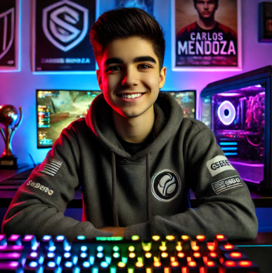

# Stakeholders

## Developers

Ben Roth: Lead Developer, Git Maintainer, and Quality Assurance Lead

Kyle Blair: SCRUM Master

Kaleb Lindon: Game Design Lead

We each will fill various other roles while working on the project depending on what is needed. All three of us have the largest stakes, as we are the ones who
need to graduate. We all want to graduate and to have a project worth presenting by the end of Spring Term. On top of this, we want to further our eduction and 
experience, allowing us to progress into the future. If all goes well, we may consider taking this project further after we graduate.

## Advisors

Becka Morgan: Becka is a stakeholder as she is our professor and advises us on how to complete our project effeciently and effectively. Being our professor,
              she wants us all to graduate, and we need to pass this class in order to do so. 

## Outside Expert

Chris Brooks: Chris has a stake because he is spending time meeting with us and coaching us through the project. Like Becka, he wants to see us succeed. He 
              will be sharing his expertise and ensuring we don't stray too far off the path.

# Personas

## Persona 1: Emma Reynolds

Hometown: Austin, Texas, USA

Age: 27

Job: Software Engineer at a tech startup

Background: Emma grew up in a family of avid gamers and was introduced to gaming through LAN parties with her older siblings. She enjoys story-driven RPGs, strategy games, and cooperative multiplayer experiences. As a software engineer, Emma has an analytical mindset and is drawn to games with intricate mechanics and puzzles.

## Persona 2: Carlos Mendoza

Hometown: Bogotá, Colombia

Age: 19

Job: University student studying mechanical engineering

Background: Carlos grew up in a bustling urban area and was introduced to gaming through mobile devices before moving to consoles and PCs. He has a particular passion for racing games, first-person shooters, and esports. Carlos competes in local gaming tournaments and dreams of becoming a professional esports player.

## Persona 3: Aisha Patel

Hometown: Mumbai, India

Age: 35

Job: Freelance Graphic Designer

Background: Aisha discovered gaming as a form of relaxation during long working hours as a designer. She gravitates toward visually stunning games, simulations, and sandbox-style experiences where creativity can flourish. Aisha also enjoys casual games that she can play in short bursts between client meetings.

